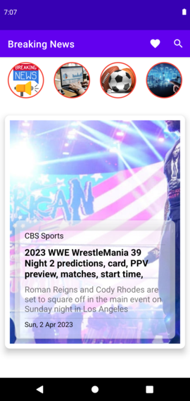
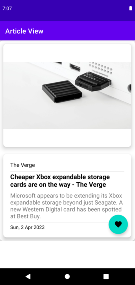
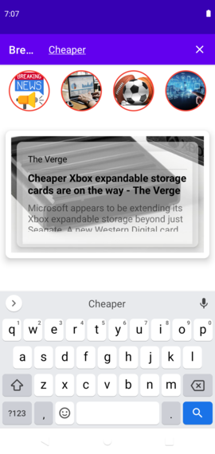
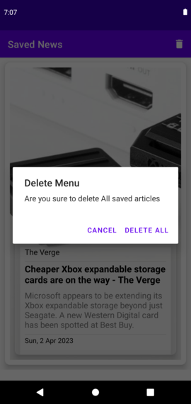

## NEWS APP - Kotlin Coroutines | MVVM | Navigation | Retrofit | Room |

### YouTube Tutorial : https://www.youtube.com/watch?v=VgiMOHZNGjM&list=PLKETiCsEsH0rGpSDazN5Zv053FShtmb1K

1. Navigation Component
2. Retrofit
3. Fragments
4. Kotlin coroutines.
5. Room
6. MVVM.
7. Search View

#### if you want to use this app, enter your own API key in the Utils class 

### Breaking News Fragment 

### Article View Fragment

### Saved News Fragment

### SearchView

### Dialog to Delete

